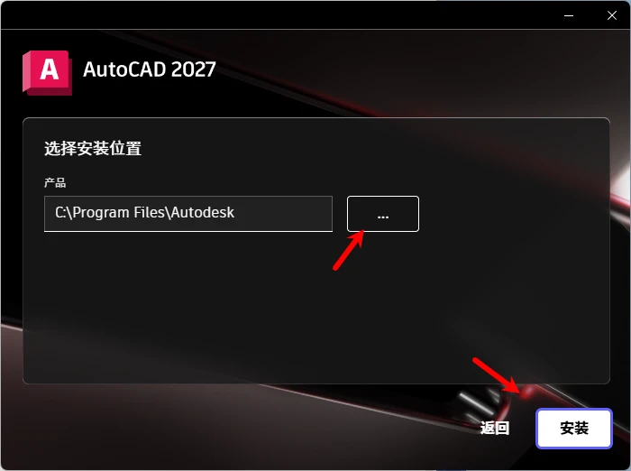

### 第一步：下载安装包  
搜索或者微信扫描下面的公众号：积木好课  
回复关键词：CAD2027  

### 第二步：安装主程序  
下载解压后的文件，然后双击 Setup.exe 文件开始安装，弹出的窗口选择：是。  
开许可界面，勾选我同意使用条款，然后点击下一步按钮  
  
选择安装位置：  
如果需要更改安装位置，则点击三个点的浏览按钮切换到其他盘符，如果C盘空间充足，建议保持默认，直接点击点击安装。  
  
等待安装完成即可。安装完毕如果要求重启，请选择重新启动后在继续后面的步骤。  
  
### 第三步：激活  
把安装包中的替换文件夹中的acad.exe这个文件复制，然后粘贴到主程序安装位置，默认安装位置如果默认是C盘则为：  
C:\Program Files\Autodesk\AutoCAD 2027  
粘贴时选择替换目标文件即为激活。  

### 相关学习：  
Autodesk认证教师私人定制或一对一教学：  
[https://jimuhaoke.com/blog/one-on-one-teaching](https://jimuhaoke.com/blog/one-on-one-teaching)

AutoCAD二维制图课程：

[https://jimuhaoke.com/blog/autocad-2d-drafting-course](https://jimuhaoke.com/blog/autocad-2d-drafting-course)

AutoCAD三维建模课程：

[https://jimuhaoke.com/blog/autocad-3d-modeling-course](https://jimuhaoke.com/blog/autocad-3d-modeling-course)

AutoCAD高级渲染课程：

[https://jimuhaoke.com/blog/autocad-advanced-rendering-course](https://jimuhaoke.com/blog/autocad-advanced-rendering-course)